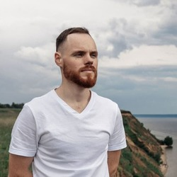

# ALEKSEY SAVIN



### Studing frontend developer
---
## Contacts
**Phone:** 8 (987) 816-33-63

**E-mail:** 89878163363@mail.ru

**Telegram:** @Soultechn

## Some about myself


 **Education:**

Main specialty is an engineer of automation and telemechanics in railway transport. Graduating Samara State Railway University in 2015.

 **Timeline:**

 - 2021 - Leading technologist at the Kuibyshev Center for Innovative Development (Kuibyshev Railway).
 - 2020 - Technologist (Kuybyshev Railway)
 - 2018 - Engineer (Kuybyshev Railway)
 - 2017 - Dispatcher (Privolzhskaya Railway)
 - 2017 - Electromechanist (Privolzhskaya Railway)


---


**Skills:**
-
**Tasks:**


- Project activities;
- Putting into production;
- Project documentation;
- Process approach (development);
- Organization of events;
- Business correspondence;
- GOST documentation;
- Audio-video production;
- Remote control;
- Tests ;  
and other


**Soft-Skills:**
- Managing projects, people and yourself;
- Communication;
- Critical thinking;
- Problem solving;
- Making decisions;
- Introspection and self-reflection;
- Mentoring and mentoring;
- Nonviolent communication;
- Service / customer focus

**Hard-Skills:**

- CAD (Kompas 3D, MS Visio);
- 3D printing (Repetier host, Idea Maker);
- MS Word, Excel, Power Point;
- EPC, FAD (ARIS:Designer);
- Adobe Photoshop, Coreldraw                
and other

**Courses:**
- Agile;
- Self-development;
- Hoshin Kanri;
- Сross-foresight;
- Time management;
- Rolling Score School: "JavaScript/Front-end. Stage 0" (VS Code, GIT, HTML5, CSS)


**Projects:**

[CV (Markdown)](https://soultechn.github.io/rsschool-cv/cv)

[CV (HTML, CSS)](https://soultechn.github.io/rsschool-cv/)

**Code example:**

```
function dataReverse(data) {
  let rev = [];
  const n = data.length / 8;
   for (i = n - 1; i >= 0; i = i - 1) {
    for (j = 0; j <= 7; j = j + 1) {
      rev[(n - 1 - i) * 8 + j] = data[i * 8 + j];
    }
    } 
return rev;
}
```

---

**Languages:**

- Russian (native)
- English (A2)

---


**Hobbies:**

- Mountain bike (Samara Amateur Cup Champion, Federal amateur competition winner);
- Guitar _classic/western/rock_ (3 bands, some projects);
- Shooting;
- Swimming;
- Skiing (mountain/XC);
- Electronics  (arduino beginner);
- hand-made (wood, metal, locksmith)
